# Introduction to Arrow

## What is Apache Arrow?

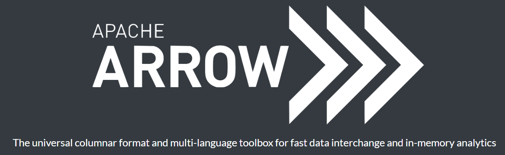

**Apache Arrow** is a [language-agnostic](https://en.wikipedia.org/wiki/Language-agnostic "Language-agnostic") [software framework](https://en.wikipedia.org/wiki/Software_framework "Software framework") for developing data analytics applications that process [columnar data](https://en.wikipedia.org/wiki/Column-oriented_DBMS "Column-oriented DBMS"). It contains a standardized column-oriented memory format that is able to represent flat and hierarchical data for efficient analytic operations on modern [CPU](https://en.wikipedia.org/wiki/Central_processing_unit "Central processing unit") and [GPU](https://en.wikipedia.org/wiki/Graphics_processing_unit "Graphics processing unit") hardware (<https://en.wikipedia.org/>).

Arrow can be used with [Apache Parquet](https://en.wikipedia.org/wiki/Apache_Parquet "Apache Parquet"), [Apache Spark](https://en.wikipedia.org/wiki/Apache_Spark "Apache Spark"), [NumPy](https://en.wikipedia.org/wiki/NumPy "NumPy"), [PySpark](https://en.wikipedia.org/wiki/PySpark "PySpark"), [pandas](https://en.wikipedia.org/wiki/Pandas_(software) "Pandas (software)") and other data processing libraries. The project includes native [software libraries](https://en.wikipedia.org/wiki/Library_(computing) "Library (computing)") written in C, C++, C#, Go, Java, JavaScript, Julia, MATLAB, Python (PyArrow^[\[8\]](https://en.wikipedia.org/wiki/Apache_Arrow#cite_note-8)^), R, Ruby, and Rust. Arrow allows for zero-copy reads and fast data access and interchange without serialization overhead between these languages and systems (<https://en.wikipedia.org/>).

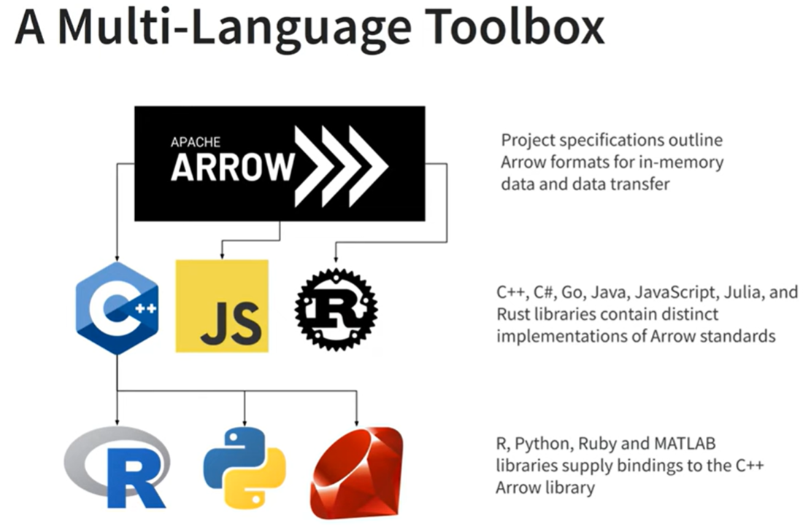

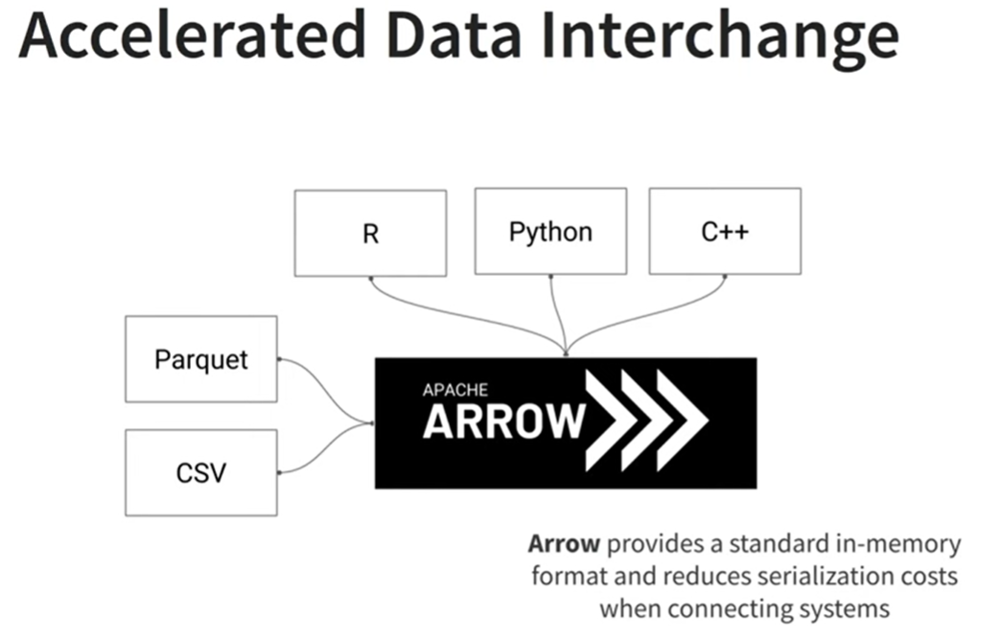

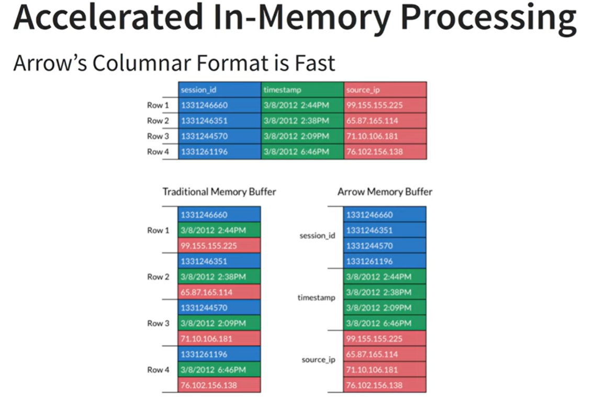

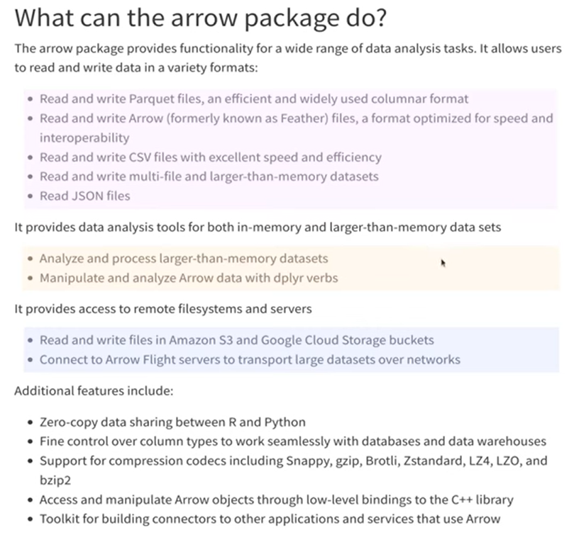

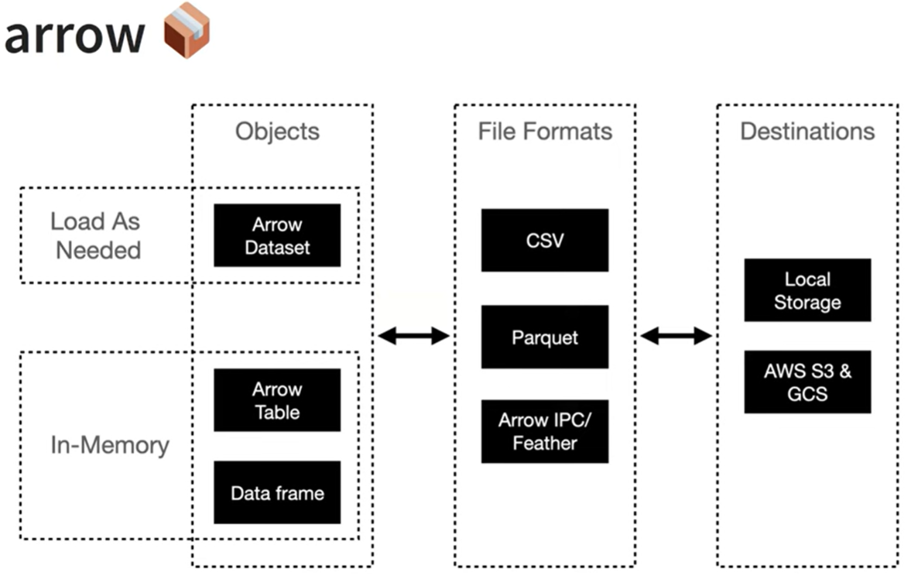

## Learning Resources

-   Scaling Up With R and Arrow (<https://arrowrbook.com/>)

-   R4DS, Chapter 22 (<https://r4ds.hadley.nz/arrow.html>)

## What you will learn from this lecture

-   You’ll learn about a powerful alternative: the `parquet` format, an open standards-based format widely used by big data systems.

-   `parquet` is designed for efficient storage and fast querying, making it ideal for large datasets. It’s a **columnar storage** format, which means it stores data by columns rather than rows, allowing for better compression and faster read times.

-   We’ll pair `parquet` files with [Apache Arrow](#0), a cross-language development platform for in-memory data.

-   We’ll use Apache Arrow via the [arrow package](https://arrow.apache.org/docs/r/), which provides a dplyr backend allowing you to analyze larger-than-memory datasets using familiar dplyr syntax.

-   Both **`arrow`** and **`dbplyr`** provide dplyr backends, so you might wonder when to use each.

## When to Use Arrow vs. dbplyr

-   Use **`arrow`** when working with large datasets stored in **`parquet`** files, especially when you want to perform in-memory analytics without the overhead of a database connection.
-   Use **`dbplyr`** when you have data stored in a ***relational database*** and want to leverage **SQL** for querying, especially if you need to perform complex joins or transactions that are better handled by a database system.

# Getting the data

## Data Source:

-    [data.seattle.gov/Community/Checkouts-by-Title/tmmm-ytt6](https://data.seattle.gov/Community/Checkouts-by-Title/tmmm-ytt6)

    -   Item checkout data from Seattle public libraries

    -   9GB CSV file

## What's in the Data?

Rows

:   **50.3M**

Columns

:   **12**

Each row is a

:   **Checkout Count**

**Columns (12)**

| **Column Name** | **Description** | **API Field Name** | **Data Type** |
|:-----------------|:------------------|:-----------------|:-----------------|
| UsageClass | Denotes if item is “physical” or “digital” | usageclass | [Text](https://dev.socrata.com/docs/datatypes/text.html) |
| CheckoutType | Denotes the vendor tool used to check out the item. | checkouttype | [Text](https://dev.socrata.com/docs/datatypes/text.html) |
| MaterialType | Describes the type of item checked out (examples: book, song movie, music, magazine) | materialtype | [Text](https://dev.socrata.com/docs/datatypes/text.html) |
| CheckoutYear | The 4-digit year of checkout for this record. | checkoutyear | [Number](https://dev.socrata.com/docs/datatypes/number.html) |
| CheckoutMonth | The month of checkout for this record. | checkoutmonth | [Number](https://dev.socrata.com/docs/datatypes/number.html) |
| Checkouts | A count of the number of times the title was checked out within the “Checkout Month”. | checkouts | [Number](https://dev.socrata.com/docs/datatypes/number.html) |
| Title | The full title and subtitle of an individual item | title | [Text](https://dev.socrata.com/docs/datatypes/text.html) |
| ISBN | A comma separated list of ISBNs associated with the item record for the checkout. | isbn | [Text](https://dev.socrata.com/docs/datatypes/text.html) |
| Creator | The author or entity responsible for authoring the item. | creator | [Text](https://dev.socrata.com/docs/datatypes/text.html) |
| Subjects | The subject of the item as it appears in the catalog | subjects | [Text](https://dev.socrata.com/docs/datatypes/text.html) |
| Publisher | The publisher of the title | publisher | [Text](https://dev.socrata.com/docs/datatypes/text.html) |
| PublicationYear | The year from the catalog record in which the item was published, printed, or copyrighted. | publicationyear | [Text](https://dev.socrata.com/docs/datatypes/text.html) |

-   <https://data.seattle.gov/Community-and-Culture/Checkouts-by-Title/tmmm-ytt6/data_preview>

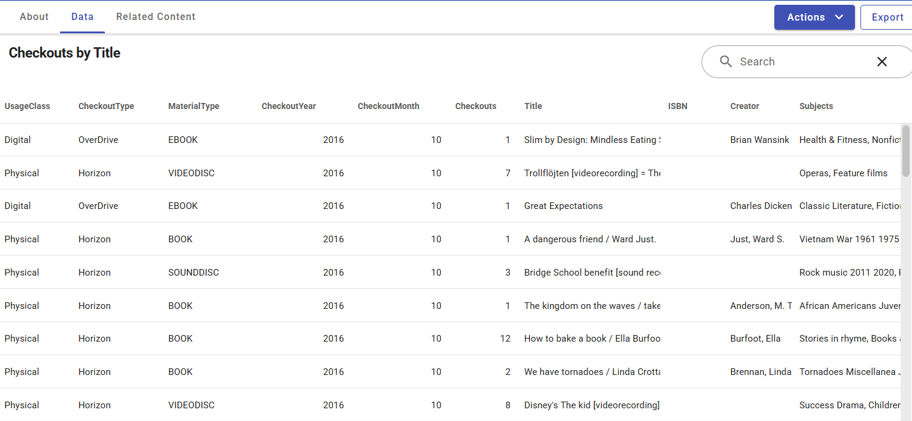

## Setting Up Arrow

To get started with `arrow`, you can install the package from CRAN:

```{r}
# install.packages("arrow")
library(arrow)
library(tidyverse)
```

## Downloading Data

```{r}
#| eval: true
dir.create("data", showWarnings = FALSE)

curl::multi_download(
  urls = "https://r4ds.s3.us-west-2.amazonaws.com/seattle-library-checkouts.csv",
  destfiles = "data/seattle-library-checkouts.csv", # almost 9GB size when saved
  resume = TRUE
)
```

-   Alternatively, you can use this approach below.

```{r}
#| eval: false
options(timeout = 1800)
download.file(
  url = "https://r4ds.s3.us-west-2.amazonaws.com/seattle-library-checkouts.csv",
  destfile = ".data/seattle-library-checkouts.csv"
)
file.size("./data/seattle-library-checkouts.csv") / 10**9
```

# Opening a Dataset

-   A good rule of thumb is that you usually want at least **twice as much memory** as the size of the data, and many laptops top out at **16 GB**.

-   This means we want to avoid **read_csv()** and instead use the **arrow::open_dataset()**:

```{r}
seattle_csv <- open_dataset(
  sources = "data/seattle-library-checkouts.csv",
  col_types = schema(ISBN = string()), # ISBN is null above: string == NULL
  format = "csv"
)

```

-   When you open a file with `open_dataset()` and save it as an object, it becomes a schema object

```         
> seattle_csv
FileSystemDataset with 1 csv file
12 columns
UsageClass: string
CheckoutType: string
MaterialType: string
CheckoutYear: int64
CheckoutMonth: int64
Checkouts: int64
Title: string
ISBN: string
Creator: string
Subjects: string
Publisher: string
PublicationYear: string
```

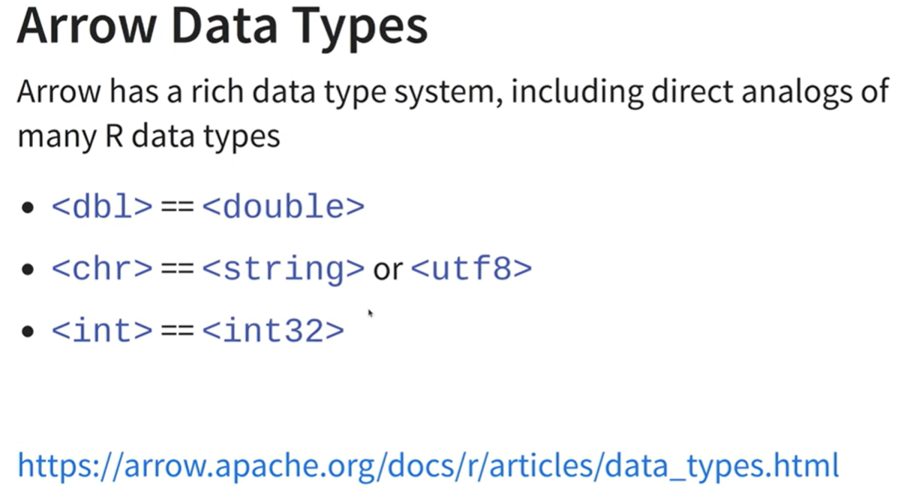

```{r}
seattle_csv
# or
schema(seattle_csv)

nrow(seattle_csv) # 41 million. Takes some time to get this

glimpse(seattle_csv) # Takes time
```

-   We can start to use this dataset with dplyr verbs, using `collect()` to force arrow to perform the computation and return some data.

```{r}
seattle_csv |>
  group_by(CheckoutYear) |>
  summarize(checkouts = sum(Checkouts)) |>
  arrange(CheckoutYear) # Arrow object

seattle_csv |>
  group_by(CheckoutYear) |>
  summarize(checkouts = sum(Checkouts)) |>
  arrange(CheckoutYear) |>
  collect() # tibble data frame
```

-   The code above still works, but the speed can be improved with `parquet`

# Data Manipulation with Arrow

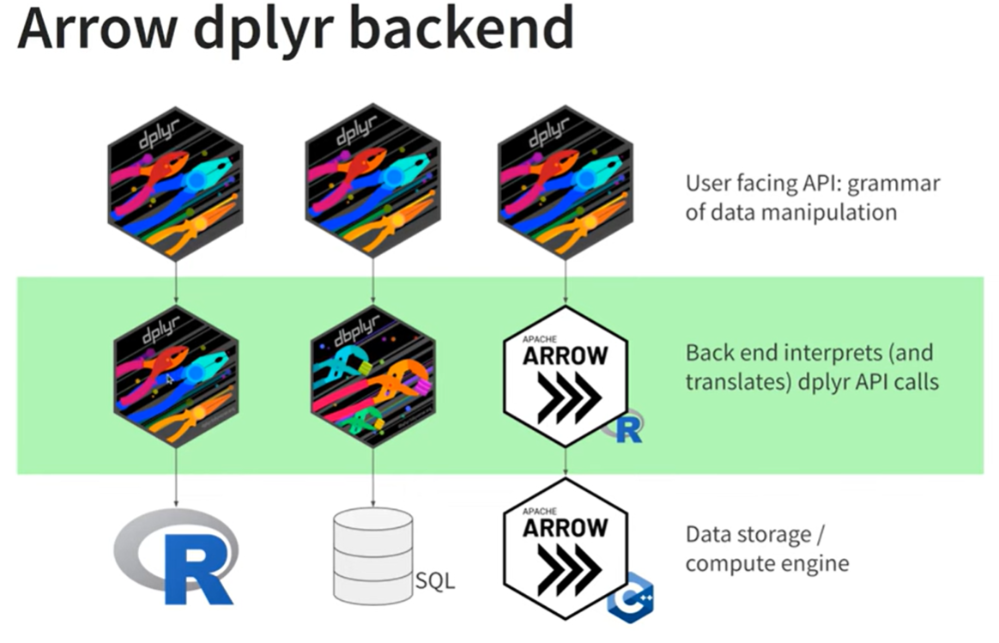

```{r}
#| eval: false
seattle_csv |>
  mutate(IsBook = endsWith(MaterialType, "BOOK")) |> #endWith: base
  select(MaterialType, IsBook) # query
```

**Output**:

```         
FileSystemDataset (query)
MaterialType: string
IsBook: bool (ends_with(MaterialType, {pattern="BOOK", ignore_case=false}))

See $.data for the source Arrow object
```

> Nothing is pulled into memory yet.

```{r}
#| eval: false
seattle_csv |>
  head(20) |>
  mutate(IsBook = endsWith(MaterialType, "BOOK")) |> #endWith: base
  select(MaterialType, IsBook) # query too, but it took a lot more time
```

**Output**:

```         
Table (query)
MaterialType: string
IsBook: bool (ends_with(MaterialType, {pattern="BOOK", ignore_case=false}))

See $.data for the source Arrow object
```

```{r}
#| eval: false

seattle_csv |>
  head(20) |>
  mutate(IsBook = endsWith(MaterialType, "BOOK")) |>
  select(MaterialType, IsBook) |>
  collect() # dplyr

seattle_csv |>
  filter(endsWith(MaterialType, "BOOK")) |>
  group_by(CheckoutYear) |>
  summarise(Checkouts = sum(Checkouts)) |>
  arrange(CheckoutYear) # query: source Arrow object

seattle_csv |>
  filter(endsWith(MaterialType, "BOOK")) |>
  group_by(CheckoutYear) |>
  summarise(Checkouts = sum(Checkouts)) |>
  arrange(CheckoutYear) |>
  collect() #18 rows of a tible dataframe

seattle_csv |>
  filter(endsWith(MaterialType, "BOOK")) |>
  group_by(CheckoutYear) |>
  summarise(Checkouts = sum(Checkouts)) |>
  arrange(CheckoutYear) |>
  collect() |>
  system.time()
```

::: callout-warning
Arrow schema data takes long time to query.

```         
   user  system elapsed 
  14.25    5.43   14.69 
```
:::

## `collect()` vs. `compute()`

**`collect()`**

-   Executes the query **and pulls the result into R** as a local `tibble`. Now the data lives in your R session's memory.

-   Use it as the **final step** when you're done filtering/aggregating and need the data for plotting, modeling, or exporting.

**`compute()`**

-   Executes the query but **keeps the result on the remote/backend side** (database table, Arrow dataset, etc.). It materializes the result into a temporary table in-place without pulling data into R memory.

-   Use it when you want to **checkpoint** an intermediate result that you'll query again — avoids re-running expensive upstream steps.

```{r}
#| eval: false

seattle_csv_compute <- seattle_csv |>
  filter(endsWith(MaterialType, "BOOK")) |>
  group_by(CheckoutYear) |>
  summarise(Checkouts = sum(Checkouts)) |>
  arrange(CheckoutYear) |>
  compute()

seattle_csv_compute |> nrow()

seattle_csv_compute |> print()

seattle_csv_compute |> glimpse()

seattle_csv_compute |> head()

seattle_csv_compute |> skimr::skim()

seattle_csv_compute |> collect()
```

-   Both are from `dplyr`

### Key Differences

| Feature | `collect()` | `compute()` |
|------------------------|------------------------|------------------------|
| **Where result lives** | Local R memory | Remote source (DB, Spark) |
| **Return type** | Local tibble/data frame | Remote `tbl` reference |
| **Use case** | Final step; bring data into R | Intermediate step; cache in DB |
| **Memory impact** | Uses R's RAM | Uses remote storage |
| **Further lazy ops?** | No (it's local now) | Yes (still a remote reference) |

## When to use which

-   Use **`collect()`** when you're done querying and need the data in R for plotting, modeling, or export.

-   Use **`compute()`** when your query is complex/expensive and you want to **cache an intermediate result** in the database to build further queries on top of it — avoiding recomputation.

### Use Case

A common pattern is to use `compute()` for heavy intermediate transformations, then `collect()` at the very end:

```{{r}}
filtered <- tbl(con, "big_table") |>
  filter(status == "active") |>
  group_by(region) |>
  summarise(n = n()) |>
  compute() # Cache this aggregation in the DB

final <- filtered |>
  filter(n > 100) |>
  collect() # Now bring into R
```

# Engineering Data with Apache Parquet

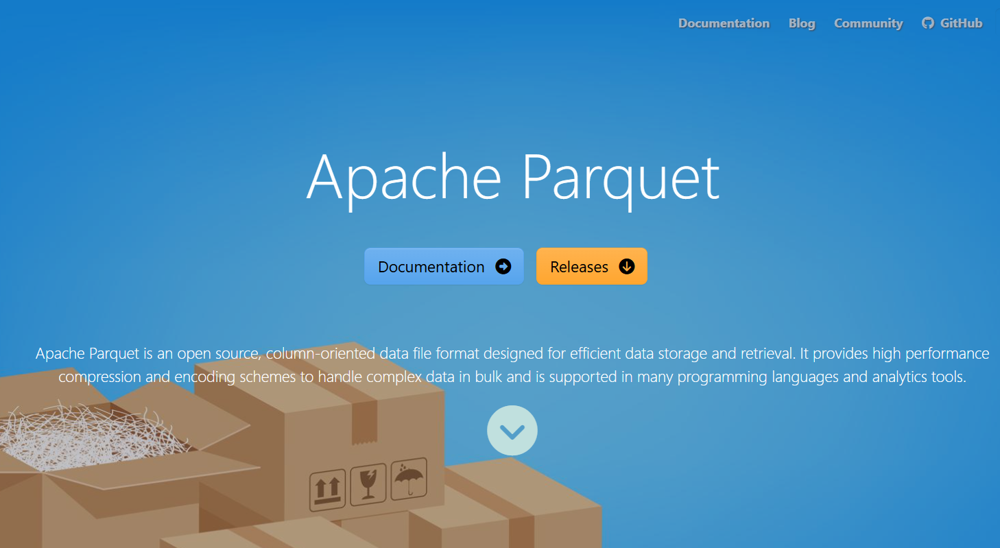

## What is Apache Parquet?

Apache Parquet is an open-source **columnar storage file format** designed for efficient data storage and retrieval, particularly in big data ecosystems.

-   parquet is used for **rectangular data**.

-   It is a custom **binary format** specifically for the needs of big data.

### Key Features

-   **Compression** — Similar values stored together compress extremely well (e.g., a column of integers vs. mixed row data). Supports Snappy, Gzip, Zstd, etc.

-   **Predicate pushdown** — Stores min/max statistics per row group, so query engines can skip entire chunks of data without reading them.

-   **Schema evolution** — Columns can be added or removed over time without rewriting old files.

-   **Nested data support** — Handles complex types like **arrays, maps, and structs** (using Dremel encoding).

-   **Language agnostic** — Readable by Python, R, Java, Scala, C++, and more.

## Why It Matters

| Scenario | Benefit |
|------------------------------------|------------------------------------|
| Analytical queries (`SELECT col_a, col_b`) | Only reads needed columns → much faster |
| Large datasets | 5–10x smaller than equivalent CSV |
| Cloud storage (S3, GCS) | Fewer bytes transferred = lower cost |
| Distributed systems | Works natively with Spark, Hive, Presto, Dask |

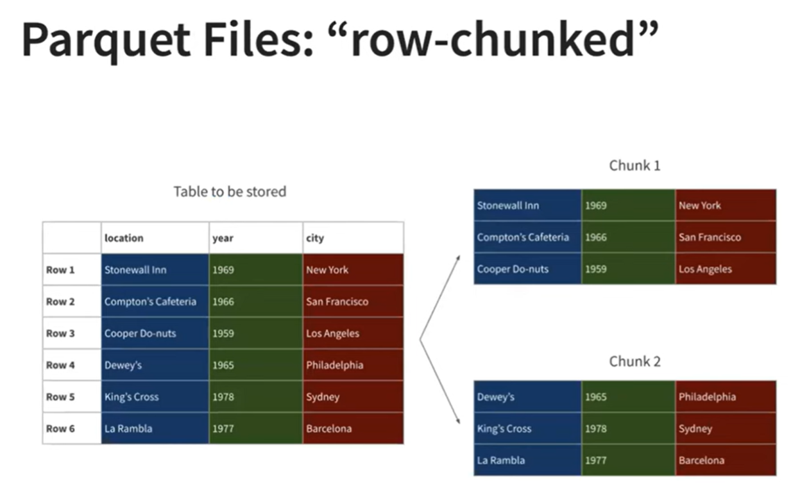

## Advantages of parquet

| Comparison Dimensions | CSV | Parquet |
|--------------------------|-------------------|---------------------------|
| File size | Larger | Smaller, compressed |
| Speed | Slower | Faster |
| Ability to identify file type | No information | Has a rich type system about column |
| Organization | Row-oriented | Column-oriented |
| Operation | Not Chunked | Chunked |
| Readerable? - readr::read_file() | Readeable to humans | Unreadeable to humans |

## Parquet vs. Other Formats

| Format        | Type         | Compressed | Columnar | Human-readable |
|---------------|--------------|------------|----------|----------------|
| CSV           | Row          | No         | No       | Yes            |
| JSON          | Row          | No         | No       | Yes            |
| Feather/Arrow | Columnar     | Optional   | Yes      | No             |
| **Parquet**   | **Columnar** | **Yes**    | **Yes**  | **No**         |
| ORC           | Columnar     | Yes        | Yes      | No             |

Parquet has become essentially the **standard format for data lakes and analytics pipelines** — you'll find it everywhere from AWS S3 + Athena to Databricks to dbt projects.

## Common Use in R

```{r}
#| eval: false
library(arrow)

# Write
write_parquet(my_df, "data.parquet")

# Read (entire file)
df <- read_parquet("data.parquet")

# Read only specific columns (very efficient)
df <- read_parquet("data.parquet", col_select = c("age", "region"))

```

## Resources

-   <https://parquet.apache.org/>

## Parquet Format

1.  Split the file into multiple files

    -   Parquet

    -   Partitioning

2.  Apply the concept to the Seattle library data

# Converting Arrow Data Type to a Single Parquet Data

## Saving to Local Directory

```{r}
seattle_parquet_dir <- "./data/seattle-library-checkouts-parquet"
```

```{r}
#| eval: false

seattle_csv |>
  write_dataset(path = seattle_parquet_dir, format = "parquet") # Arrow

```

## Opening The Parquet File + Arrow + dplyr

```{r}
#| eval: false
open_dataset(sources = seattle_parquet_dir, format = "parquet")
# also
open_dataset(seattle_parquet_dir) #File system dataset
```

**Output**:

```         
FileSystemDataset with 1 Parquet file
12 columns
UsageClass: string
CheckoutType: string
MaterialType: string
CheckoutYear: int64
CheckoutMonth: int64
Checkouts: int64
Title: string
ISBN: string
Creator: string
Subjects: string
Publisher: string
PublicationYear: string
```

### Measuring Speed

```{r}
#| eval: false
open_dataset(sources = seattle_parquet_dir, format = "parquet") |>
  filter(endsWith(MaterialType, "BOOK")) |>
  group_by(CheckoutYear) |>
  summarise(Checkouts = sum(Checkouts)) |>
  arrange(CheckoutYear) |>
  collect() |>
  system.time()
```

**Output**:

```         
   user  system elapsed 
   5.75    3.81    2.05 
```

## Measuring Size

```{r}
#| eval: false
file <- list.files(seattle_parquet_dir, recursive = TRUE, full.names = TRUE)
file.size(file) / 10^9
```

**Output**:

```         
[1] 4.416318
```

-   The file size was reduced by half compared with CSV file on-disk.

# Partitioning (Converting Arrow File into Multiple Parquets)

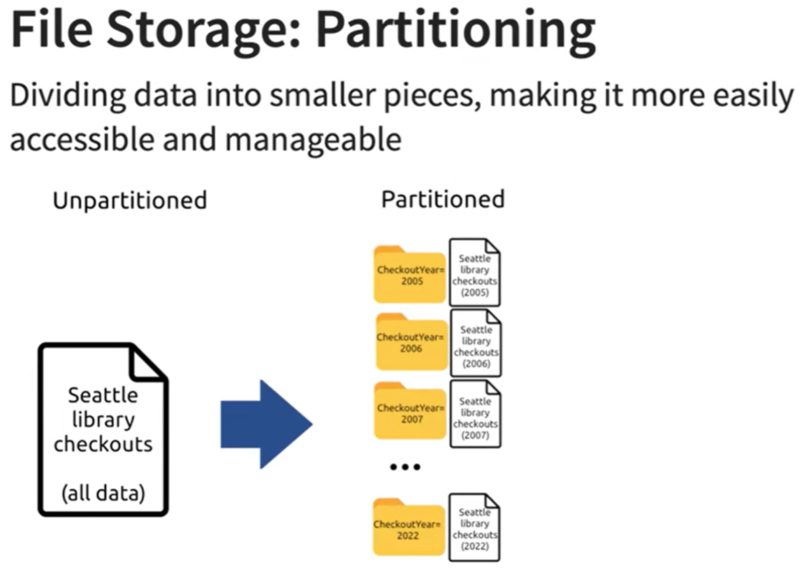

-   **Why Petitioning?**

    -   As datasets get larger and larger, storing all the data in a single file gets increasingly painful and it’s often useful to split large datasets across many files.

    -   Many analyses will only require a subset of the files.

-   No hard and fast rules about how to partition your dataset;

-   Rough guideline

    -   Avoid files smaller than 20MB and larger than 2GB

    -   Avoid partitions that produce more than 10,000 files. 

    -   Partition by variables that you filter by

## Saving Data

```{r}
seattle_parquet_part <- "./data/seattle-library-checkouts"
```

```{r}
#| eval: false

seattle_csv |>
  group_by(CheckoutYear) |>
  write_dataset(path = seattle_parquet_part, format = "parquet")
```

## Opening the Data

```{r}
open_dataset(sources = seattle_parquet_part, format = "parquet") |>
  filter(endsWith(MaterialType, "BOOK")) |>
  group_by(CheckoutYear) |>
  summarise(Checkouts = sum(Checkouts)) |>
  arrange(CheckoutYear) |>
  collect()
```

### Measuring Speed

```{r}
#| eval: false
open_dataset(sources = seattle_parquet_part, format = "parquet") |>
  filter(endsWith(MaterialType, "BOOK")) |>
  group_by(CheckoutYear) |>
  summarise(Checkouts = sum(Checkouts)) |>
  arrange(CheckoutYear) |>
  collect() |>
  system.time()
```

**Output**:

```         
   user  system elapsed 
   4.17    1.94    1.54 
```

::: callout-tip
There was not a huge gain in speed beween one parquet file and partitioning.
:::

## Comparisons with more filtering

:::::: columns
::: {.column width="49%"}
### Partitioned Parquet Files + Arrow + dplyr

```{r}
#| eval: false
# filtering by CheckoutYear as well

open_dataset(sources = seattle_parquet_part, format = "parquet") |>
  filter(CheckoutYear == 2020, endsWith(MaterialType, "BOOK")) |>
  group_by(CheckoutYear) |>
  summarise(Checkouts = sum(Checkouts)) |>
  arrange(CheckoutYear) |>
  collect() |>
  system.time()
```

**Output**:

```         
   user  system elapsed 
   0.28    0.15    0.11 
```
:::

::: {.column width="2%"}
:::

::: {.column width="49%"}
### CSV File read with Arrow function + dplyr

```{r}
#| eval: false
# filtering by CheckoutYear as well

seattle_csv |>
  filter(CheckoutYear == 2020, endsWith(MaterialType, "BOOK")) |>
  group_by(CheckoutYear) |>
  summarise(Checkouts = sum(Checkouts)) |>
  arrange(CheckoutYear) |>
  collect() |>
  system.time()
```

**Output**:

```         
   user  system elapsed 
  13.33    5.89   14.75
```
:::
::::::

# Partitioning topic in Ch22

## Saving to Local Data

```{r}
pq_path <- "data/seattle-library-checkouts"
```

```{r}
#| eval: false
seattle_csv |> # Arrow data
  group_by(CheckoutYear) |>
  write_dataset(
    path = pq_path,
    format = "parquet"
  )
```

::: callout-note
This takes about a minute to run; as we’ll see shortly this is an initial investment that pays off by making future operations much much faster.
:::

> -   Observe the partitioned files

```{r}
tibble(
  files = list.files(pq_path, recursive = TRUE),
  size_MB = file.size(file.path(pq_path, files)) / 1024^2
)

tibble(
  files = list.files(pq_path, recursive = TRUE),
  size_MB = file.size(file.path(pq_path, files)) / 1024^2
) |>
  summarize(total_size = sum(size_MB))
```

## Reading the Partioined Parquet data in

-   Using parquet data with `dplyr` and `arrow`

```{r}
seattle_pq <- open_dataset(pq_path) # directory only
seattle_pq
```

## Using `dplyr` pipeline

-   **Task**: count the total number of books checked out in each month for the last five years:

```{r}
#| eval: true

seattle_pq |>
  select(CheckoutYear, CheckoutMonth, MaterialType, Checkouts) |>
  group_by(CheckoutYear) |>
  collect()

seattle_pq |>
  count(CheckoutYear, CheckoutMonth, Checkouts) |>
  mutate(Total_checkouts = sum(Checkouts)) |>
  arrange(CheckoutYear, CheckoutMonth, Checkouts) |>
  collect()
```

```{r}
query <- seattle_pq |>
  filter(CheckoutYear >= 2018, MaterialType == "BOOK") |>
  group_by(CheckoutYear, CheckoutMonth) |>
  summarize(TotalCheckouts = sum(Checkouts)) |>
  arrange(CheckoutYear, CheckoutMonth)
```

-   **Mechnics**: you write dplyr code, which is automatically transformed into a query that the Apache Arrow C++ library understands, which is then executed when you call `collect()`

```{r}
query

query |> collect()
```

::: callout-tip
-   Like `dbplyr`, `arrow` only understands some R expressions, so you may not be able to write exactly the same code you usually would.

-   However, the list of operations and functions supported is fairly extensive and continues to grow;

-   Find a complete list of currently supported functions in ?acero. `acero` is Arrow query engine.
:::

## Performance Comparison

### One large CSV file Saved with Arrow

```{r}
#| eval: false
# Task: how long does it take to calculate the number of books checked out in each month of 2021
seattle_csv |>
  filter(CheckoutYear == 2021, MaterialType == "BOOK") |>
  group_by(CheckoutMonth) |>
  summarize(TotalCheckouts = sum(Checkouts)) |>
  arrange(desc(CheckoutMonth)) |>
  collect() |>
  system.time()
```

::: callout-note
```         
   user  system elapsed 
  12.99    5.44   15.00 
```
:::

### 18 different smaller parquet files

```{r}
#| eval: false
seattle_pq |>
  filter(CheckoutYear == 2021, MaterialType == "BOOK") |>
  group_by(CheckoutMonth) |>
  summarize(TotalCheckouts = sum(Checkouts)) |>
  arrange(desc(CheckoutMonth)) |>
  collect() |>
  system.time()
```

::: callout-note
```         
   user  system elapsed 
   0.42    0.25    0.13 
```
:::

### Performance Attribution

::: callout-important
#### Attribution

-   Partitioning improves performance because this query uses `CheckoutYear == 2021` to filter the data, and arrow is smart enough to recognize that it only needs to read 1 of the 18 parquet files.

-   Storing data in binary format can be read more directly into memory

-   The **column-wise format** and rich metadata means only four columns are needed: `CheckoutYear`, `MaterialType`, `CheckoutMonth`, and `Checkouts`
:::

# Using Duckdb with Arrow

> It’s very easy to turn an arrow dataset into a DuckDB database by calling `arrow::to_duckdb()`:

```{r}
seattle_pq |>
  to_duckdb() |>
  filter(CheckoutYear >= 2018, MaterialType == "BOOK") |>
  group_by(CheckoutYear, CheckoutMonth) |>
  summarize(TotalCheckouts = sum(Checkouts)) |>
  arrange(desc(CheckoutYear), CheckoutMonth) |>
  collect()
```

::: callout-tip
The neat thing about `to_duckdb()` is that the transfer doesn’t involve any memory copying, and speaks to the goals of the arrow ecosystem: enabling seamless transitions from one computing environment to another.
:::

## Assignment

1.  Figure out the most popular book each year.

2.  Which author has the most books in the Seattle library system?

3.  How has checkouts of books vs ebooks changed over the last 10 years?

# Reference

-   [R for Data Science, Ch22](https://r4ds.hadley.nz/arrow.html)

-   Apache Arrow (<https://arrow.apache.org/>)

-   Apache Parquet (<https://parquet.apache.org/>)

-   R-Ladies Ottawa (English) - Introduction to Arrow - Nic Crane and Steph Hazlitt, <https://www.youtube.com/watch?v=s-6aQ2hYp_E>